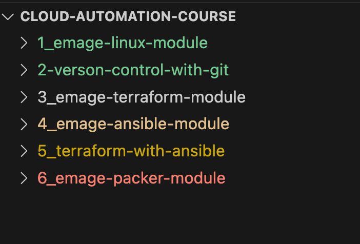

# Portfolio Template

An open-source, user-friendly, responsive, and accessible portfolio template for developers 🚀⚡

Give a star ⭐ if you find it useful. [Visit site &rarr;](https://opensource-portfolio.netlify.app/)


## Useful resources

Make sure to subscribe to our [youtube channel](https://www.youtube.com) channel where we cover creating template like this from scratch using HTML, CSS and JavaScript also don't forget to star 🌟 the [css-tips-tricks](https://github.com/emage/css-tips-tricks) that has already reached 180+ stars.

## Table of Contents

1. [Features](#key-features)
1. [Customization](#customizing-the-template)
1. [Deploying the Site](#deploying-the-site)

## Features

- Fully Mobile responsive.
- Supports light/dark theme.
- Built with a11y in mind.
- Modern design.
- Multiple sections.
- Sleek animations.
- Fast loads.
- SEO-optimized.



## Customizing the Template

Please follow these three steps to make an awe-inspiring portfolio of your own.

- [Portfolio Template](#portfolio-template)
  - [Useful resources](#useful-resources)
  - [Table of Contents](#table-of-contents)
  - [Features](#features)
  - [Customizing the Template](#customizing-the-template)
    - [Cloning the Repository.](#cloning-the-repository)
    - [Editing the Template](#editing-the-template)
    - [Deploying the Site](#deploying-the-site)

### Cloning the Repository.

If you have [Git](https://git-scm.com/) installed on your computer, you can clone or download the portfolio template by running the following command in your terminal.

```bash
git clone https://github.com/emage/portfolio-template
```

Alternatively, click on this [link](https://github.com/devsyedmohsin/portfolio-template/archive/refs/heads/main.zip) to download it.

### Editing the Template

After you get the template please open it in the code editor of your choice.
You will find a file named `index.html` Open it and follow the guidance inscribed within the comments to customize the template.

**For example:**

```html
<!-- Update with your name -->
<title>Solomon's Portfolio</title>
```

```html
<div class="header-textbox">
  <!-- Replace with your name & job title -->
  <h1 class="h1">Hi, I'm Solomon Frontend Web Developer</h1>

  <!-- Add a small introductory paragraph about yourself -->
  <p class="header-text">A frontend software engineer and interface designer</p>
</div>
```

**Note:** While editing the template, ensure you have updated all `href`, img `src`, and `alt` attributes of links and images.

### Deploying the Site
